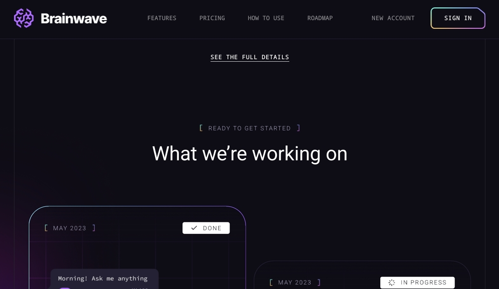
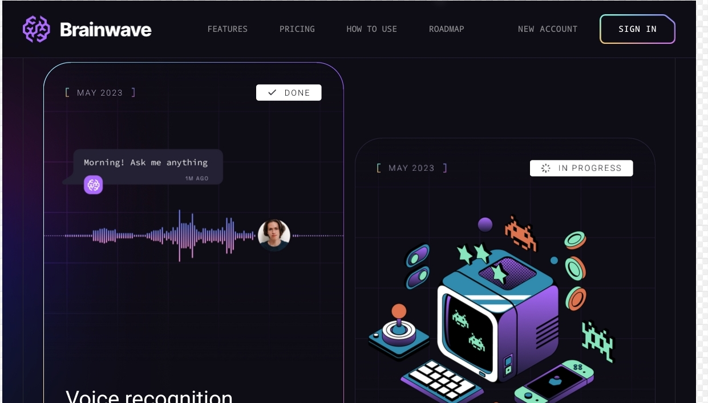
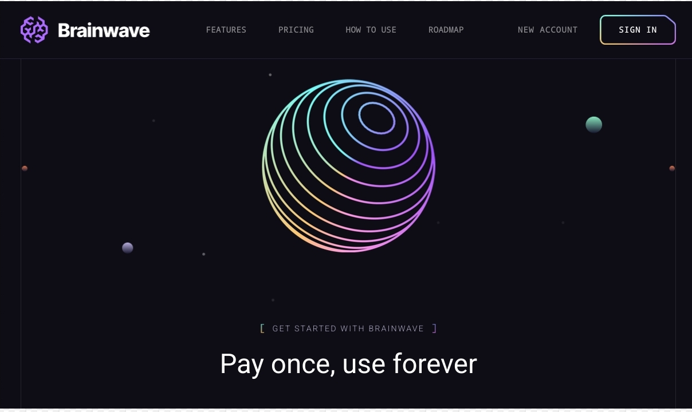
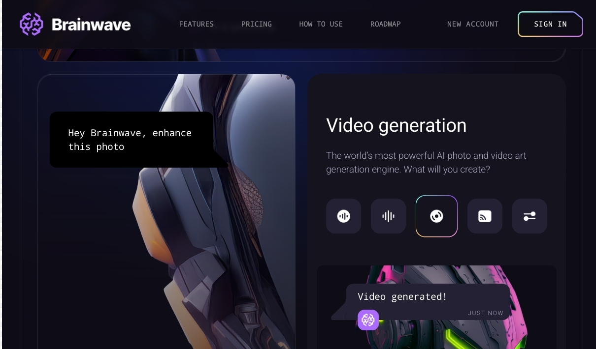
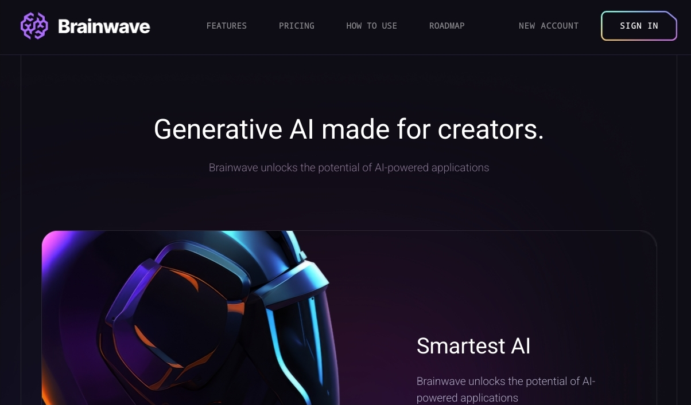
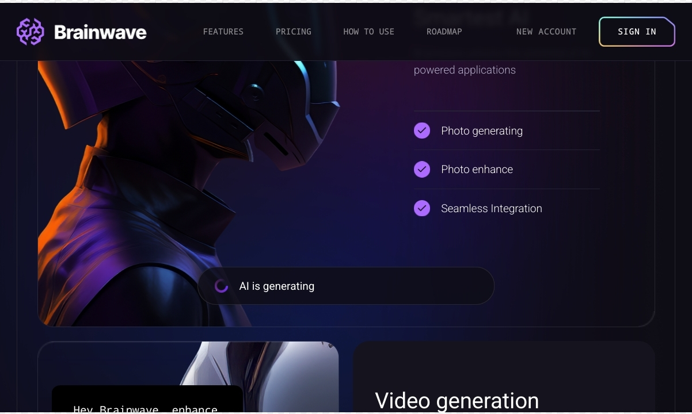
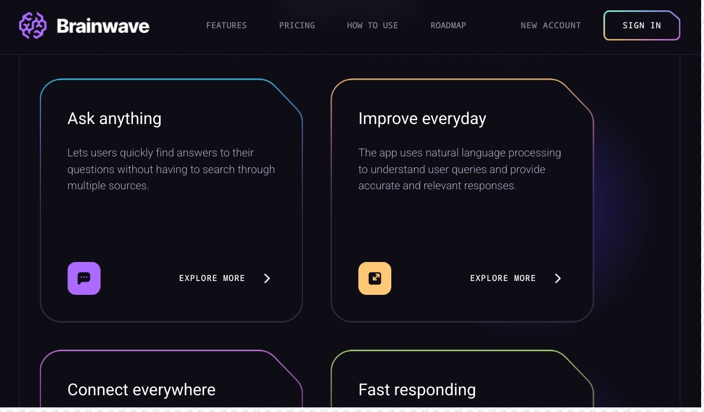
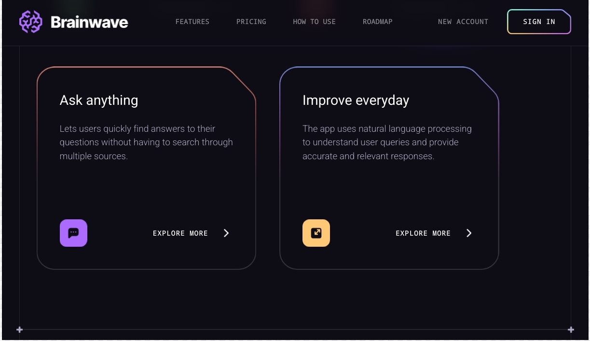
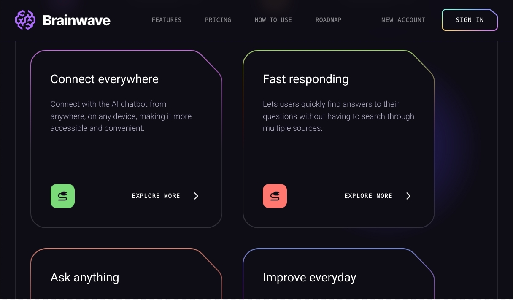
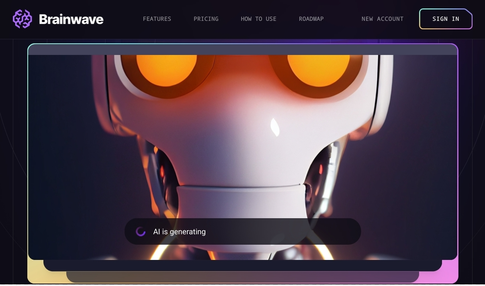

# Brainwave

Brainwave - Modern UI/UX website, developed using React.js and Tailwind CSS, exemplifies modern UI/UX principles. Its sleek design, seamless animations, and overall user experience set a high standard, serving as a reference or inspiration for future modern applications or websites in general.

## Functionalities

👉 **Beautiful Sections**: Includes hero, services, features, how to use, roadmap, pricing, footer, and header.

👉 **Parallax Animations**: Engaging effects triggered by mouse movement and scrolling

👉 **Complex UI Geometry**: Utilizes tailwindcss for intricate shapes like circular feature displays, grid lines, and side lines.

👉 **Latest UI Trends**: Incorporates modern design elements such as bento grids.

👉 **Cool Gradients**: Enhances visuals with stylish gradients using Tailwind CSS for cards, buttons, etc.

👉 **Responsive**: Ensures seamless functionality and aesthetics across all devices

and many more, including code architecture and reusability

## Technologies Used

- **React**: Frontend framework for building dynamic and interactive user interfaces.
- **Tailwind CSS**: Utility-first CSS framework for rapid UI development and customization.
- **vite** : a build tool that aims to provide a faster and leaner development experience for modern web projects
## Screenshots

## Getting Started

To run the project locally, follow these steps:

1. Clone the repository: `git clone <repository_url>`
2. Navigate to the project directory: `cd brainwave`
3. Install dependencies: `npm install`
4. Start the development server: `npm run dev`

## License

This project is licensed under the [MIT License](LICENSE).
